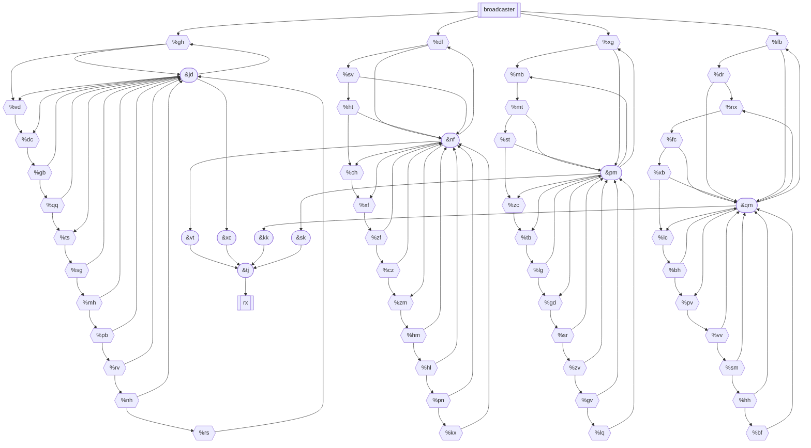

Observation: The network is four 12-bit binary counters with feedback. Feedback is accomplished with one conjunction module per counter - some bits of the counter are fed in, while other bits have the conjunction module as an input.

Each of those 4 conjunction modules is passed through another single-input conjunction module acting as an inverter, which are then sent through one more conjunction module connecting to the output node (rx).

From MSB to LSB, the counters are as follows. 0 means that bit is used as an output, 1 means it is an input with feedback. The LSB is both an input and output, shown as X:
- `00000010011X`
- `00001001100X`
- `00001011001X`
- `00001010010X`

The feedback gates are normally in a `HIGH` state, and when all inputs go `LOW` so does the feedback. This whole network is active-low, so the counters only see feedback when all output bits are 0.

Let's consider the first counter. The conjunction node `&jd` first enables when the counter reads `111111011001` (where `1` means `LOW`, since this network is active-low). When it does so, it pulses `LOW` and sets the `0` bits to `1`, which resets the counter. Hence, this first counter has a period of `0b111111011001` = 4057. Note that this is the complement of the counter encoding above, if `X` is treated as a `0`.

A similar logic follows for the other counters. By inspection, the periods are:
- `0b111111011001` = 4057
- `0b111101100111` = 3943
- `0b111101001101` = 3917
- `0b111101011011` = 3931

The LCM of these numbers gives us the minimum number of cycles on which `&jd`, `&nf`, `&pm`, and `&qm` latch `LOW`, which will cause the inverters to latch `HIGH`, then and finally `&tj` and `rx` LOW.

```ipython
In [1]: import math

In [2]: math.lcm(4057, 3943, 3917, 3931)
Out[2]: 246313604784977
```
