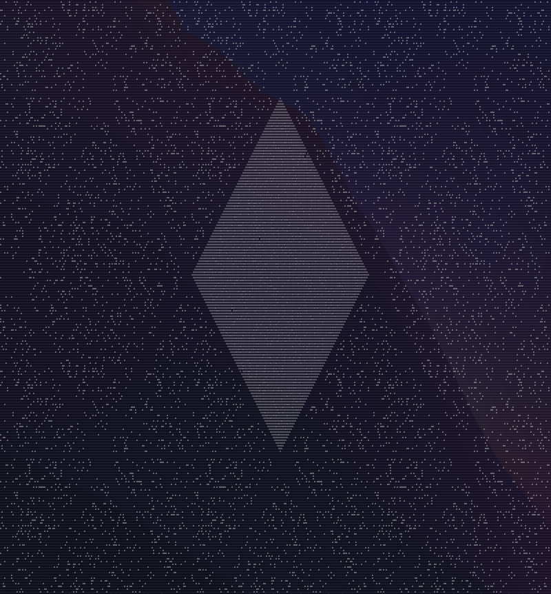
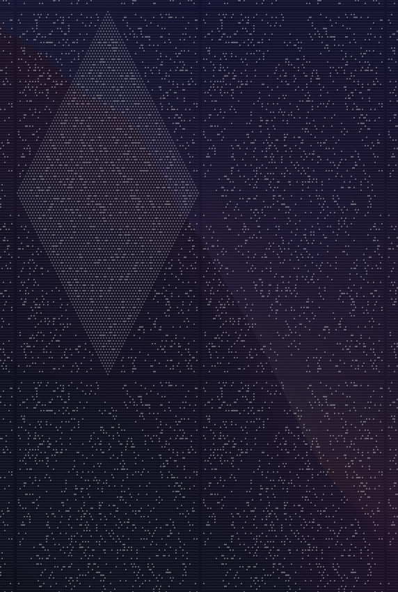

# Day 21 Part 2 Observations

## Making the search algorithm better
- Once a region of the board is fully "saturated", it will alternate between two states on every iteration. We don't need to constantly re-compute that region.
- If we shift the world so that the starting cell is at (0, 0), then at each step we alternate the parity of the sum of the coordinate dimensions. On even steps x + y will be even, and at odd steps it will be odd. We can hence keep track of just the cells we've visited overall, and count the ones with the proper parity at the end.
  - This made it quite a bit faster, but nowhere near enough

## Abusing the input
The input is a specially crafted to have a diamond region of open space that allows the frontier to "repair" itself from interference with the rocks

The diamond frontier becomes fully "repaired" at steps:
- 65
- 196
- 327
- ...

The difference between each of these is 131, which is the width of the diamond pattern and also coincidentally (not really) the side lengths of the input. 65 is the number of steps required to first reach the outside of the input, from the center. The example does not exhibit these characteristics.

Here's what the total set of visited cells looks like after 65 steps (use the parity trick above to figure out which ones are possible at that step):



Note: The diamond appears stretched because my terminal font is taller than a character is wide, but it has 90-degree corners in reality.

At this point, for every additional 131 steps we go we fill in another "ring" of diamonds. For $x$ rings (where the first diamond is $x=0$), we have $(2x+1)^2$ total filled in.

Next, consider the number of steps we want to find the reachable plots for: 26501365. If we subtract 65 for the number of steps to get fill our initial diamond, we get $(26501365 - 65) / 131 = 202300$. At the desired number of steps, therefore, we will have $2 \times 202300 + 1)^2$ diamonds filled in. 

At this point, we might (aka I did) ask our program for the number of reachable cells after 65 steps, and multiply it by the number of diamonds we will have visited. 

That won't work, however, again because of parity. When a diamond reaches the edge of its bounds, it will be adjacent to another diamond. Exactly tiling the same diamond will result in two (diagonal), adjacent lines of identical values. We need to consider that the parity of each abutting diamond must also alternate:

```
     /\
    /--\
   /\--/\
  /++\/++\
 /\++/\++/\
/--\/--\/--\
\--/\--/\--/
 \/++\/++\/
  \++/\++/ 
   \/--\/
    \--/
     \/
```

However, we're still missing one big piece.

### Corners Exist

Our discussion thus far has involved solving for the center diamond, then tiling it out. However, this doesn't account for the corners in the input. I had hoped they were designed to produce nicely tiled copies of the center diamond, but nope - we'll end up with different diamonds formed from the adjacent copies of the input corners.

This is more obvious if we space out each copy of the input a bit in the visualization:



Just by inspection, there are two distinct diamonds: One formed from the center of the input, and one formed where the inputs intersect. So in the above ASCII art, while parity does matter, so too does which of the two diamond patterns we are considering.

At this point, we have three options:
1. Come up with a new algorithm that is based around tiling the input along the x and y axes, rather than tiling a diamond along the diagonal axes.
    - This seems like a lot of work
2. Figure out a way to compute the number of reachable spaces from the center of the other diamond for each parity, and use that. Oh, did I mention that the starting point is handily in the center of the diamond?
    - Sadly this doesn't work, since the corner diamonds have a side length of 130 instead of 131, so they have no center to start at.
3. Re-scale the problem - Instead of tiling just one diamond, tile the 3x3 diamond region which will include everything. This means we do a similar analysis as above, but starting with using our algorithm to get the answer for 196 steps first (65 + 131).
    - Instead of each iteration bringing us an additional 2 rings away from the origin, we are now brought out 6 rings (since each meta-ring is 3 smaller rings).
    - Unfortunately 202300 (the number of single-diamond rings we need) is not divisible by 3, so this doesn't work.
    - However, it is divisible by 5, so we just tile a 5x5 region instead! That is reach at 720 steps from the origin, so we have our program calculate that.
    - For whatever reason, I can't get this to work.

### It's just a quadratic apparently

It is at this point that I decided I wanted to enjoy time off with my family, so I skimmed the reddit. There were some computational solutions that were similar to what I had so far regarding parity, and I'm pretty sure I could have got option #3 above to work. However, a couple posts mentioned a quadratic fit, so I gave that a try...

And it didn't work. Turns out I had a typo in my spreadsheet tracking things, I had recorded the number of possible places at step 65 as 3994 rather than 3944 🙃. Always copy-paste, kids!

In the end, it was just a matter of having our program solve for `steps = 65 + 131*n` for n in (0, 1, 2), which covers up to a 5x5 diamond grid as we've discussed above. Fitting a quadratic to that (I just used wolfram alpha) and evaluating at n=202300 gives the desired answer of 634549784009844. As we've seen above, this relies on a number of input-specific properties:
- There is a diamond-shaped buffer region that allows the wavefronts to "repair"
- The starting point is at the center of the input
- Parity plays into this somehow, but I can't yet reason how.
